# ForexRadar Architecture Diagrams

Visual documentation of data flows and system architecture.

---

## System Overview

```mermaid
graph TB
    subgraph "Data Providers"
        VISA[Visa API]
        MC[Mastercard API]
        ECB[ECB Website]
    end

    subgraph "GitHub Actions"
        DAILY[daily-update.js]
        BACKFILL[backfill-orchestrator.js]
    end

    subgraph "Git Repository"
        CSV[("db/CURR/YEAR.csv")]
        WATCHLIST[watchlist.json]
    end

    subgraph "GitHub Pages"
        STATIC[Static Files]
    end

    subgraph "User Browser"
        APP[Frontend App]
        IDB[(IndexedDB Cache)]
    end

    VISA --> DAILY
    MC --> DAILY
    ECB --> DAILY
    VISA --> BACKFILL
    MC --> BACKFILL

    WATCHLIST --> DAILY
    WATCHLIST --> BACKFILL

    DAILY --> CSV
    BACKFILL --> CSV

    CSV --> STATIC
    STATIC --> APP
    APP <--> IDB

    VISA -.->|CORS Proxy| APP
    MC -.->|CORS Proxy| APP
```

---

## Backend: Daily Update Flow

```mermaid
sequenceDiagram
    participant GH as GitHub Actions
    participant DU as daily-update.js
    participant WL as watchlist.json
    participant VISA as Visa API
    participant MC as Mastercard API
    participant ECB as ECB Website
    participant CSV as csv-store.js
    participant GIT as Git

    GH->>DU: Cron trigger (UTC 17/19/21/23)
    DU->>WL: Load currency pairs
    
    loop Each Visa/MC pair
        DU->>CSV: Check if exists for date
        alt Not exists
            DU->>VISA: fetchRate(date, from, to)
            VISA-->>DU: RateRecord
            DU->>CSV: store.add(record)
            DU->>MC: fetchRate(date, from, to)
            MC-->>DU: RateRecord
            DU->>CSV: store.add(record)
        end
    end

    loop Each ECB currency
        DU->>ECB: fetchAllRates(currency)
        ECB-->>DU: EUR↔Currency rates
        DU->>CSV: store.add(records)
    end

    DU->>GIT: Commit & push CSV changes
    
    alt Failures detected
        DU->>GH: Create GitHub Issue via gh CLI
    end
```

---

## Backend: Backfill Orchestrator Flow

---

## Backend: Mastercard Session Management

---

## Frontend: Progressive Data Loading

---

## Frontend: Data Manager Merge Logic

---

## Frontend: Chart Rendering

---

## CSV Sharding Structure

---

## Cache Staleness Logic

---

## Error Handling Flow

